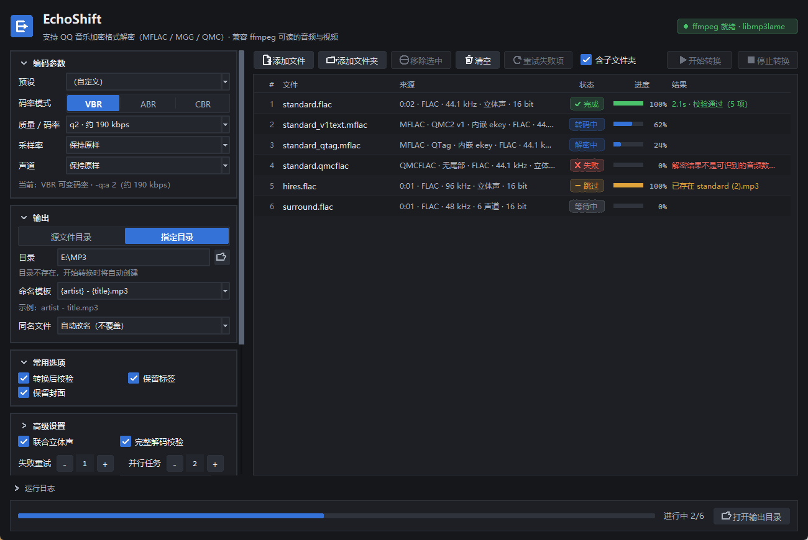
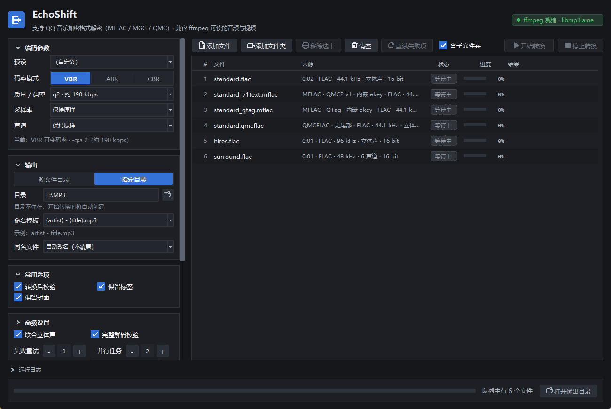
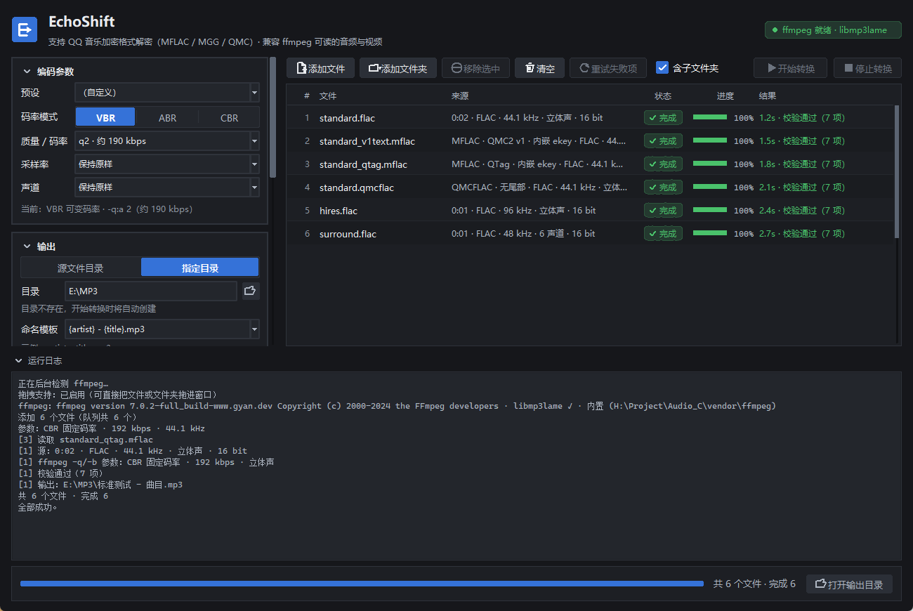

# EchoShift · 音频转 MP3（含 QQ 音乐加密格式解密）

Windows 桌面音频转换工具：把 ffmpeg 能读的**任何音频/视频**，以及 **QQ 音乐加密容器**
（MFLAC / MGG / QMC）转成 **MP3**，并且能精细控制 **比特率** 与 **采样率**。

界面是深色主题的 Tkinter，转码后端是内置的 ffmpeg + libmp3lame，**用户端零依赖**：解压即可用，
不需要另外装 Python、ffmpeg 或任何运行库。

> **用途与合规**：本项目用于把**你自己合法持有**的音频文件在本地做格式转换
> （例如把无损文件压成车载能放的 MP3）。它不提供、不获取、不绕过任何内容授权，
> 不读取 QQ 音乐客户端的登录凭据，也不会自动向任何服务器索取密钥；
> 仓库**不附带任何密钥**。请自行确认你的使用符合所在地区的法律与相关服务条款。
> 详见[许可与合规](#许可与合规)。



<p align="center">
  
  
</p>

左侧是常用设置，高级设置默认收起；右侧队列带**行内进度条**、状态胶囊与状态色。
选中条目后，队列下方固定显示两行摘要，点击可展开完整路径、参数、警告、错误和输出路径。
这里不再使用文件信息悬浮窗。失败条目会直接显示原因，并自动展开日志。

---

## 使用方式（只想用，不想改代码）

1. 打开 [Releases](https://github.com/k1anyang/EchoShift/releases/latest)，下载
   `EchoShift-<版本>-win64.zip`。
2. 解压到**任意可写目录**（整个文件夹一起，不要只把 `EchoShift.exe` 拖出来）。
3. 双击 `EchoShift.exe`。免安装、免管理员权限；整份文件夹拷到别的 Windows 机器也能直接跑。

首次使用建议先拖一两个文件试一次，确认输出目录和参数符合预期，再整目录批量转换。

> Release 里没有打包产物时，可以自己打包（见[发布一个版本](#发布一个版本)），
> 或者直接跑源码（下一节）。

---

## 目录

- [快速开始](#快速开始)
- [使用方式](#使用方式只想用不想改代码)
- [能做什么](#能做什么)
- [编码参数详解](#编码参数详解)
- [MFLAC / QMC 支持情况](#mflac--qmc-支持情况)
- [输出命名模板](#输出命名模板)
- [命令行用法](#命令行用法)
- [项目结构](#项目结构)
- [开发、测试与打包](#开发测试与打包)
- [发布一个版本](#发布一个版本)
- [已知限制](#已知限制)
- [许可与合规](#许可与合规)

---

## 快速开始

EchoShift 只有**一个入口：`EchoShift.exe`**。从 Release 下载解压后双击即可，
不需要 Python、不需要 ffmpeg、不需要任何运行库。

其余内容（跑源码、命令行、打包）都只面向想改代码的人。

### 直接跑源码（需要 Python 3.10+）

仓库已包含 `vendor/ffmpeg`，克隆下来就能跑：

```powershell
git clone https://github.com/k1anyang/EchoShift.git
cd EchoShift
.\launch_gui.pyw                   # 图形界面（无控制台窗口）
```

或者不借助任何脚本：

```powershell
$env:PYTHONPATH = "src"
pythonw -m echoshift.gui.app       # 或者 python -m echoshift.gui.app
```

> 换成自备的 ffmpeg 时，跑 `tools\vendor_ffmpeg.ps1`：
> 默认从 BtbN 的 `gpl-shared` 构建下载并校验 `libmp3lame`，
> 也可以 `-SourceDir "C:\path\to\ffmpeg\bin"` 从本机已有安装目录复制。
> 没有 ffmpeg 时界面仍会启动，但会提示「ffmpeg 不可用」。

`launch_gui.pyw` 自己把 `src` 加进 `sys.path`，所以它不依赖任何环境变量。
也可以用它生成一个真正的 Windows 快捷方式（放桌面或开始菜单）：

```powershell
.\tools\make_shortcut.ps1                              # 生成在项目根目录
.\tools\make_shortcut.ps1 -Destination "$env:USERPROFILE\Desktop"
```

它记录的是**生成时**的绝对路径，仓库不含它，挪动文件夹后重新生成即可。

> 应用图标由 `tools/make_icon.py` 生成（用界面同一套配色画出来，不是外部素材），
> 改成别的配色后重跑一次即可。

### 打包成便携 EXE

```powershell
.\build.ps1                 # 先跑测试，再生成 dist\EchoShift\EchoShift.exe
.\build.ps1 -OneFile        # 改成自解压单文件（启动慢几秒）
.\build.ps1 -SkipTests      # 跳过测试
```

打包需要 `pip install pyinstaller`，并且需要先有 `vendor/ffmpeg`。
默认产出**文件夹**布局：内置 ffmpeg 的 DLL 有约 50 MB，单文件版每次启动都要把它们解压一遍。
产物已内含 ffmpeg 与 Python 运行时，整份 `EchoShift` 文件夹拷到别的 Windows 机器即可运行。
怎么把它发出去见[发布一个版本](#发布一个版本)。

---

## 能做什么

**输入**

| 类型 | 扩展名 | 是否需要密钥 |
| --- | --- | --- |
| 普通音频/视频 | 见下方说明 | 否 |
| QMC1 加密容器 | `.qmcflac` `.qmc0` `.qmc3` `.qmcogg` | **否**，算法自带 |
| QMC2 加密容器（QTag / V1 尾部） | `.mflac` `.mflac0` `.mflach` `.mgg` `.mgg0` `.mgg1` `.mggl` | 否，自动提取 |
| QMC2 加密容器（musicex 尾部） | 同上 | **是**，需外部 ekey |

关于「普通音频/视频」的范围：

> **ffprobe 才是权威，扩展名只是提示。**
> 判据不是文件名，而是 ffmpeg 能不能读懂内容。
>
> - **你显式添加的文件**（拖拽、文件对话框、命令行指名）**一律会尝试**。
>   `song.xyz`、没有扩展名、扩展名写错的文件，只要内容是 ffmpeg 认识的音频，就能转。
> - **扫描文件夹时**才做过滤，否则音乐目录里的 `.jpg` / `.cue` / `.log` 会被一起丢进队列。
>   过滤条件是「扩展名在白名单里」**或**「文件头字节是已知媒体签名」，
>   所以改了名的音频照样会被捡起来。
>
> 内置白名单覆盖常见音频（flac / wav / aiff / ape / wv / tta / dsf / mp3 / m4a / m4b /
> aac / ogg / oga / opus / wma / ac3 / dts / amr / caf / midi …）与常见视频容器
> （mp4 / mkv / webm / mov / avi / flv / ts …，会抽取第一条音轨）。
> 完整列表见 `src/echoshift/qmc/decoder.py` 里的 `PLAIN_AUDIO_EXTENSIONS`
> 与 `VIDEO_CONTAINER_EXTENSIONS`。

**功能**

- 批量队列，支持拖拽文件/文件夹（递归），逐项与总体进度
- 比特率三档控制：**VBR**（LAME `-q 0–9`）、**ABR**、**CBR**（8–320 kbps）
- 采样率 8 k–48 k 九档可选，或「保持原样」；源采样率非法时自动降到最近的合法值并提示
- 声道处理：保持原样 / 下混单声道 / 强制立体声；多声道源自动下混
- 标签与封面完整迁移（ID3v2.4 或 2.3，内嵌 APIC 封面）
- 输出命名模板（`{artist}/{album}/{track:02d} {title}.mp3` 之类）
- 同名文件策略：自动改名 / 覆盖 / 跳过
- 失败自动重试、转换后校验（可解码性、时长比对、采样率/声道/码率核对）
- ffmpeg 连续 120 秒没有进度会自动终止并重试；停止与关闭窗口不会阻塞界面线程
- 先写隐藏的 `.part.mp3`，校验成功后原子替换，失败或取消不会留下残缺 MP3
- 候选 ekey 来源：界面手填、同名 `.ekey` 文件、JSON 密钥库

---

## 编码参数详解

### 三种码率模式

| 模式 | ffmpeg 参数 | 说明 | 适合 |
| --- | --- | --- | --- |
| **VBR** | `-q:a N`（N=0–9） | 质量恒定、码率浮动。N 越小越好 | 音乐库长期保存（默认 `q2`） |
| **ABR** | `-b:a Nk -abr 1` | 平均码率，体积可控 | 想要体积稳定又想省空间 |
| **CBR** | `-b:a Nk` | 恒定码率，兼容性最好 | 老播放器、车载音响 |

LAME 的 VBR 质量档位参考（软件里也会显示）：

| q | 0 | 1 | 2 | 3 | 4 | 5 | 6 | 7 | 8 | 9 |
| --- | --- | --- | --- | --- | --- | --- | --- | --- | --- | --- |
| 约 kbps | 245 | 225 | 190 | 175 | 165 | 130 | 115 | 100 | 85 | 65 |

### 采样率与码率的合法组合

MP3 不是随便配的：**可用码率区间取决于采样率所属的 MPEG 版本**。

| MPEG 版本 | 采样率 | 合法码率 |
| --- | --- | --- |
| MPEG-1 | 32000 / 44100 / 48000 Hz | 32 – 320 kbps |
| MPEG-2 | 16000 / 22050 / 24000 Hz | 8 – 160 kbps |
| MPEG-2.5 | 8000 / 11025 / 12000 Hz | 8 – 160 kbps |

超出范围的组合（例如「22050 Hz + 320 kbps」）会被**直接拒绝并给出可选项**，而不是悄悄改参数。
界面里的码率下拉框也会跟着采样率自动收窄。

### 采样率与声道是「按文件」决定的

- 选「保持原样」时，96 kHz / 192 kHz 这类 MP3 不支持的高采样率源会自动降到 48 kHz，并在日志里提示。
- 源文件是 5.1 等多声道时，「保持原样」会自动下混成立体声并提示；想强制单声道请选「单声道」。

---

## MFLAC / QMC 支持情况

QQ 音乐用两代加密方案，本项目在 `src/echoshift/qmc/` 下完整实现了它们：

- **QMC1**（`.qmcflac` / `.qmc0` / `.qmc3` / `.qmcogg`）：基于固定种子的 XOR 掩码，
  **不需要任何密钥**，开箱即用。
- **QMC2**（`.mflac` / `.mgg` 系列）：需要 ekey，并且按解码后密钥长度自动选择两种算法之一：
  - 密钥 ≤ 300 字节 → **Map** 密码
  - 密钥 > 300 字节 → **改进版 RC4**，每 5120 字节重新派生一次

  ekey 本身还可能是 TC-TEA（腾讯魔改 TEA）加密封装的，实现里也一并处理了。

### ekey 从哪来

解码器**只使用**以下三类来源，按优先级排列：

1. **文件内嵌**（QTag 或 V1 尾部）——优先级最高，因为它是可验证正确的那个。
   传入的手填 ekey 不会覆盖它，避免把本来能解的文件弄坏。
2. **界面/命令行手动指定**的 ekey。
3. **同名密钥文件**：`song.mflac.ekey`、`song.ekey`（内容可以是裸 ekey、`ekey,songid` 或 `{"ekey": "..."}`）。
4. **JSON 密钥库**：按 `mid` / `song_id` / 文件名匹配。

只有当容器是**现代 musicex 尾部**（QQ 音乐 ≥ 19.57）时，文件里才完全没有密钥，
这时才必须靠 2–4 中的一种提供。

> **本项目不会、也没有实现「自动从 QQ 音乐服务器拉取 ekey」**：
> 那需要读取本机 QQ 音乐客户端的登录凭据（Windows 上还得读运行中进程的内存），
> 这件事超出「本地格式转换」的范围。所以 musicex 文件需要你自己提供 ekey。
>
> 仓库里也**不附带任何密钥**：`vendor/keys/qmc_keys.json` 是一个空壳，格式见文件内注释。

### V1 尾部有两种写法，真实文件用的是不常见的那一种

`.mflac` 的 V1 尾部结构是 `[密钥区][u32 LE 密钥区长度]`。问题出在「密钥区装什么」——
公开实现之间并不一致：

| 写法 | 密钥区内容 | 谁在用 |
| --- | --- | --- |
| **文本式** | **ASCII base64 的 ekey 字符串**，NUL 结尾 | **QQ 音乐真实下载的 `.mflac`** |
| 原始式 | 原始密钥字节 | 部分第三方工具产出的文件 |

早期版本只实现了「原始式」（把密钥区字节再 base64 编码一次，再交给解析器），
于是**真实文件一律解不开**：双重编码，密钥全错，解出来就是噪声。

现在两种解读都会被列出，解码器**拿文件自己的头几十字节去试**，留下真正能解出
`fLaC` 签名的那一个。因此两种写法都能开，也不依赖把猜测写对。

### 装了 19.51 还是解不开？

先跑 `python -X utf8 -m echoshift 文件.mflac --diagnose`，看「结论」那一行：

1. **尾部类型 = `musicex`，或尾部标记里什么都没有**
   → 这个文件里根本没有 ekey。
   **换回 19.51 并不会给已经下载好的文件补上密钥**——旧版本只会加密它自己新下载的文件。
   必须用 19.51 把这首歌**重新下载一遍**，尾部才会带密钥。
2. **尾部类型 = `QTag` / `QMC2 v1`，但「解密后头部」不是 `fLaC`**
   → 拿到了密钥却解不开。两种 V1 写法都试过还不行的，说明是第三种布局——
   把 `--diagnose` 的完整输出发出来，尾部十六进制那几行就能定位。
3. **尾部类型 = `QTag` / `QMC2 v1`，且「解密后头部」是 `fLaC`**
   → 解密没问题，问题在后面的转码环节，看日志里的具体报错。

### 解密正确性怎么保证的

- 三个密码（QMC1 / Map / RC4）都按参考实现逐行移植，并跑参考实现自带的**测试向量**。
- 尾部布局用**真实文件**核对过，不是只照文档实现：`.mflac` 的 V1 尾部装的是
  ASCII base64 ekey 文本，不是原始密钥字节（见上一节）。测试夹具 `standard_v1text.mflac`
  就是照真实下载的结构造的，包含 EncV2 外层。
- 加密容器的端到端测试覆盖 **5 种封装**：QMC1、V1+原始密钥 ×2（Map/RC4）、QTag、
  V1+文本 ekey（EncV2）。它们和原始 FLAC 用相同参数转换后 **MP3 逐字节相同**。
- 解密完成后会**嗅探前 16 字节**：如果不是 `fLaC` / `OggS` / `ID3` 等已知音频签名，
  就报「ekey 很可能不正确」并提示跑 `--diagnose`，而不是输出一个听着像噪声的 MP3。
- ekey 的多种解读是**按文件实测挑选**的，不是按启发式猜的。

---

## 输出命名模板

模板里的 `/` 是目录分隔符，可用变量：

```
{filename} {title} {artist} {album} {albumartist} {track} {disc}
{year} {genre} {composer} {index} {samplerate} {bitrate} {mode}
```

支持格式说明（如 `{track:02d}`）。几个要点：

- 缺失的标签替换为空串，`{artist} - {title}.mp3` 在无艺术家标签时会退化成 `标题.mp3`，
  不会留下 `" - 标题.mp3"` 这种残缺名字。
- **标签值里的 `/` 会被替换成 `_`**——`AC/DC` 不会变成两级目录。
- 文件名里的 Windows 非法字符、保留设备名（`CON`、`LPT1`…）都会被处理。
- 模板无法逃出输出目录：`..` 和绝对路径都会被中和。

内置模板：

| 说明 | 模板 |
| --- | --- |
| 艺术家 - 标题（默认） | `{artist} - {title}.mp3` |
| 保持原文件名 | `{filename}.mp3` |
| 音乐库结构 | `{artist}/{album}/{track:02d} {title}.mp3` |
| 专辑艺术家 / 专辑 | `{albumartist}/{album}/{title}.mp3` |
| 含碟号 | `{artist}/{album}/{disc:02d}{track:02d} {title}.mp3` |

---

## 命令行用法

命令行**没有独立的启动方式**，直接用解释器模块入口。`-X utf8` 是必需的：
中文版 Windows 控制台默认 GBK，编码不出工具输出的 `✓` 与中文（漏掉它也不会崩，
`echoshift.console` 会兜底重设流编码，但显式打开更可靠）。

```powershell
$env:PYTHONPATH = "src"          # 或先 pip install -e .
python -X utf8 -m echoshift --help
python -X utf8 -m echoshift --list-presets
```

常用示例：

```powershell
# 单个文件，V0 最高质量
python -X utf8 -m echoshift song.flac -o out --mode vbr -q 0

# 加密文件 + 手填 ekey，固定 320 kbps
python -X utf8 -m echoshift locked.mflac --ekey "<EKEY>" -o out --mode cbr -b 320

# 整个目录递归，重采样到 44.1 kHz 并强制立体声，4 线程并行
python -X utf8 -m echoshift D:\Music -o D:\MP3 -r --sample-rate 44100 --channels stereo -j 4

# 只看会得到什么，不实际转换
python -X utf8 -m echoshift song.mflac --dry-run

# mflac 打不开时：打印文件头尾、尾部布局与密钥判定（不转换）
python -X utf8 -m echoshift broken.mflac --diagnose

# 机器可读的结果（含每项校验明细）
python -X utf8 -m echoshift D:\Music -o D:\MP3 --json
```

退出码：`0` 全部成功，`1` 有失败项，`2` 参数错误，`3` ffmpeg 不可用，`4` 没找到输入文件。

### `--diagnose`：mflac 打不开时先跑这个

它会打印文件头/尾的十六进制与 ASCII、尾部标记（`QTag` / `musicex`）出现在哪里、
识别出的尾部类型、ekey 来源与解码后长度、选定哪个密码，以及**决定性的那一步**：
用拿到的密钥解密首块，看结果是不是 `fLaC` 这样的真实签名。

- 首块签名正常 → 密钥和布局都对，问题在下游。
- 首块不是签名 → 密钥错，或者真实布局和预期不同。
- 完全没有 ekey → 会直接告诉你是 musicex（19.57+）还是连尾部都没有。

---

## 项目结构

```
src/echoshift/
├── errors.py              异常层次（放在顶层，避免 core ↔ qmc 循环导入）
├── paths.py               内置资源定位
├── console.py             控制台 UTF-8 输出
├── cli.py                 命令行前端
├── core/
│   ├── ffmpeg.py          定位/驱动内置 ffmpeg，解析 -progress
│   ├── probe.py           ffprobe 输出的类型化视图
│   ├── settings.py        码率/采样率/声道的建模与合法性校验
│   ├── args.py            ffmpeg 命令行拼装
│   ├── naming.py          输出模板渲染与文件名消毒
│   ├── verify.py          转换后校验
│   ├── pipeline.py        作业编排（解密→探测→编码→校验）
│   ├── diagnostics.py     轮转诊断日志（落盘前遮蔽 ekey 与绝对路径）
│   └── config.py          配置持久化
├── qmc/
│   ├── tc_tea.py          腾讯魔改 TEA
│   ├── qmc1.py            QMC1（无密钥）
│   ├── qmc2.py            QMC2 Map + 改进版 RC4
│   ├── footer.py          三种尾部格式识别
│   ├── keystore.py        ekey 来源链
│   ├── parallel.py        大文件多进程分段解密（整批共用一个有界进程池）
│   ├── decoder.py         容器 inspected/解密流式写出
│   └── diagnose.py        --diagnose 的尾部布局与密钥判定
└── gui/
    ├── theme.py           深色配色、字体与 ttk 样式
    ├── metrics.py         间距与布局断点常量
    ├── text.py            字符宽度缓存与省略截断（Canvas 与标签共用）
    ├── icons.py           Canvas 矢量图标（无图片资源）
    ├── widgets.py         圆角按钮、进度条、滚动条、卡片、tooltip
    ├── queue_view.py      队列列表（Canvas 自绘：行内进度条 / 悬停 / 虚拟化）
    ├── app.py             主窗口与事件循环
    └── dnd.py             原生 WM_DROPFILES 拖拽（纯 ctypes）
tools/                     测试样本生成、冒烟、基准、截图
tests/                     pytest 套件
packaging/EchoShift.spec   PyInstaller 打包定义（唯一发布目标）
launch_gui.pyw             源码运行入口（等价于 EchoShift.exe）
vendor/ffmpeg/             内置 ffmpeg 7.0.2 + ffprobe + 依赖 DLL
vendor/keys/               空密钥库（格式见注释）
```

应用本身**只依赖 Python 标准库**（Tkinter、ctypes、argparse…），没有任何第三方运行时依赖。
`Pillow` 只在生成测试样本与截图时用到。

### 界面约定

- **间距只有四档**，定义在 `gui/metrics.py`（`GAP_XS/SM/MD/LG`），不要在控件里写裸数字。
- **颜色按语义取用**，不要按位置：`surface_alt` 是输入框底/画布底，按钮用 `control*` 系列；
  文字三级 `text` / `text_muted` / `text_faint` 都必须达到 4.5:1，`tests/test_gui.py` 会断言这件事。
- **控件状态必须可区分**：静止/悬停/按下/禁用四态在 `RoundedButton._colours()` 里定义，也有断言。
  禁用时用 `set_enabled(False, reason="…")` 说明原因，别让用户对着灰按钮猜。
- **长操作要有忙碌态**：`set_busy(True)` 会阻断重复点击；`_set_editing_locked(True)` 冻结整组输入。
- **行高与列宽由字体度量派生**（`QueueView._measure`），不要写死像素值。
- **控件尺寸不能随状态变化**：聚焦时只换颜色、不改边框粗细，文字只做单行截断、不要靠换行
  （否则整列会重排，表现为「点一下设置就跳一下」）。`tests/test_gui.py` 有对应断言。

---

## 开发、测试与打包

```powershell
pip install -e ".[dev]"

# 完整测试套件（会调用 vendor/ffmpeg 跑真实的转换）
python -m pytest tests -q

# 生成测试样本到 samples/
python tools/make_samples.py

# 端到端冒烟（覆盖 各码率模式 × 采样率 × 声道 × 三种加密）
python tools/smoke.py

# 驱动真实 GUI 组件跑一次转换（无头）
python tools/gui_smoke.py

# 解密吞吐基准（三种密码 × 1/2/4/8 进程）
python tools/bench_decrypt.py 64

# 这台机器到底有几个能用的核（cpu_count() 常常高于实际配额）
python tools/diagnose_parallelism.py

# 造真实体量（20 MiB 级）的加密夹具，专门用来复现批量卡顿
python tools/make_load_fixture.py .tmp/load 12 80 map

# 整批转换基准：同时量耗时、峰值进程数，以及「界面卡不卡」
python tools/bench_batch.py --dir .tmp/load --count 12 --workers 4
```

### 测试是怎么做到「真实」的

因为 QMC1 和 QMC2 都是对称 XOR 密码，`tools/make_samples.py` 可以**自己造出合法的加密样本**：
编码一个真 FLAC → 用密码跑一遍 → 补上容器尾部。于是测试里包含了：

- 原始 FLAC 与它的五种加密封装用相同参数转换后
  **MP3 逐字节相同**——这一条同时证明了三条解密链路和整条流水线；
- 96 kHz 源自动降到 48 kHz、5.1 源自动下混、8 kHz/单声道/32 kbps 正常产出；
- 标签与封面（含尺寸）完整迁移；
- 覆盖 / 跳过 / 改名三种同名策略；
- 错误 ekey 会被识破、失败不留临时文件、不支持扩展名不抛异常；
- 每个模块都能在**全新解释器里作为第一个 import** 成功（循环导入回归测试）。

界面部分有三层验证：

- `tools/gui_smoke.py` 驱动**真实控件树**跑完一整轮转换，并输出截图；
- `tests/test_gui.py` 覆盖配色对比度、图标注册表、列宽分配、控件四态、批次锁定与
  队列记账等纯逻辑。其中对比度断言按 WCAG AA 检查，并**逐个背景**验证三级文字色：
  正因如此强调色从 `#4c8dff` 调成了 `#3572d8`（白字 3.2:1 → 4.6:1），
  而 `text_faint` 从 `#6c737e` 调到 `#8d95a0`（最差背景 3.17:1 → 5.01:1）。
- `tools/bench_batch.py` 在真实 Tk 主循环里每 200 ms 打一次心跳，
  把「界面卡了多久」量成数字（`UI heartbeat worst`），批量转换的回归靠它守住。

界面没有跑马灯的自动化断言（Tk 的视觉输出无法可靠断言），所以改成**截图 + 人工确认**：
`python tools/screenshot_gui.py docs` 会重新生成 `docs/` 下的三张状态图。
（它必须在真实桌面会话里跑；脚本会自行声明 DPI 感知，否则抓到的会是别的窗口。）

### 打包

```powershell
pip install pyinstaller
.\build.ps1
```

`build.ps1` 默认先跑测试，再用 `packaging/EchoShift.spec` 生成无控制台窗口的
GUI 一文件夹版，并把 `vendor/` 一并塞进去。`-OneFile` 可改成自解压单文件。
入口调用了 `multiprocessing.freeze_support()`——冻结后大文件的多进程解密要靠它。

`vendor/ffmpeg` 已随仓库提供；要换成自备的，用 `tools/vendor_ffmpeg.ps1`：
默认从 BtbN 的 `gpl-shared` 构建下载并校验 `libmp3lame`，
也可以 `-SourceDir` 从本机已有的 ffmpeg 安装目录复制。

---

## 发布一个版本

给用户的东西**只有一个**：`EchoShift.exe` 及其文件夹。命令行前端不发布。

### 1. 打包

```powershell
cd H:\Project\Audio_C
.\build.ps1                      # 会先跑一遍测试，通过才继续
```

产物：`dist\EchoShift\`（约 122 MB，解压后 127 MB），结构是：

```
dist\EchoShift\
├── EchoShift.exe          ← 唯一的入口，双击运行
├── _internal\             ← Python 运行时 + 全部依赖（必须一起发布）
│   ├── vendor\ffmpeg\     ← ffmpeg.exe / ffprobe.exe 与 20 个 DLL
│   ├── vendor\keys\       ← 空密钥库（只有格式说明）
│   ├── tcl86t.dll tk86t.dll   ← Tcl/Tk（少了 exe 会在启动时报 DLL load failed）
│   └── base_library.zip …
├── LICENSE                ← 必须保留
└── 说明.txt               ← 可选，建议放一份
```

**`EchoShift.exe` 不能单独拷出来**：它依赖同级的 `_internal`，只发 exe 会报错。

### 2. 组装 zip

```powershell
# 目录里先补两个对用户有用的文件
Copy-Item LICENSE dist\EchoShift\LICENSE
@"
EchoShift — 音频转 MP3

用法：解压到任意可写目录，双击 EchoShift.exe。
      请不要只把 EchoShift.exe 单独拷出来，它需要同目录的 _internal。
      首次使用建议先拿一两个文件试一次，确认参数与输出目录符合预期。

本程序用于你自己合法持有的音频文件的本地格式转换，不提供、不获取、不绕过
任何内容授权，也不附带任何密钥。请自行确认使用符合当地法律与服务条款。

许可：GPLv3（见 LICENSE）。内置 ffmpeg 来自 gyan.dev 的 full 构建（GPL）。
源码：https://github.com/k1anyang/EchoShift
"@ | Set-Content -Path dist\EchoShift\说明.txt -Encoding UTF8

# 打包（保留目录结构；zip 里不会多出一层 EchoShift\）
Compress-Archive -Path dist\EchoShift\* -DestinationPath EchoShift-1.0.0-win64.zip -Force
```

自检一下 zip 再上传：

```powershell
(Get-Item EchoShift-1.0.0-win64.zip).Length / 1MB          # 实测约 50 MB
Remove-Item .tmp\ziptest -Recurse -Force -ErrorAction SilentlyContinue
Expand-Archive EchoShift-1.0.0-win64.zip .tmp\ziptest -Force
Test-Path .tmp\ziptest\EchoShift.exe                        # 必须是 True
Test-Path .tmp\ziptest\_internal\vendor\ffmpeg\ffmpeg.exe   # 必须是 True
# 最有用的一步：直接运行解压出来的副本
Start-Process .tmp\ziptest\EchoShift.exe
```

### 3. 挂到 GitHub Releases

在浏览器里：

1. 打开 https://github.com/k1anyang/EchoShift/releases/new
2. **Choose a tag** 填 `v1.0.0`，点 "Create new tag on publish"
3. **Release title** 填 `EchoShift 1.0.0`
4. 描述里写清：解压后双击 `EchoShift.exe`、不要单独拷 exe、只支持 Windows 64 位、
   GPLv3 与"仅限合法持有文件"的说明
5. **Attach binaries** 把 `EchoShift-1.0.0-win64.zip` 拖进去
6. **Publish release**

或者用命令行（需要 [GitHub CLI](https://cli.github.com/)）：

```powershell
gh release create v1.0.0 EchoShift-1.0.0-win64.zip `
  --title "EchoShift 1.0.0" `
  --notes "解压后双击 EchoShift.exe。不要单独拷出 exe，它需要同目录的 _internal。"
```

### 4. 发布后核对

```powershell
# 用另一台机器（或另一个目录）真的下载并跑一次
# 下载页：https://github.com/k1anyang/EchoShift/releases/latest
```

清单：解压 → 双击 → 窗口出现 → 拖入一个 `.mp3`/`.flac` 转一次 → 输出文件能播放。
这样才算发布完成。

> 想发新版本时改 `pyproject.toml` 与 `packaging/version_info.txt` 里的版本号，
> 重新打包并用新的 tag（`v1.0.1`…）再走一遍。

---

## 已知限制

- **纯 Python 的 RC4 主循环约 1.9 MB/s**，这是语言层面的天花板：一个 40 MB 的 MFLAC 大约要 21 秒
  才能解完。好在改进版 RC4 每个分段都从同一个初始 S-box 独立派生，所以字节区间可以拆开并行，
   8 个进程可以跑到约 14.5 MB/s。另外两种密码快得多，不在同一个量级：
   QMC1 约 196 MB/s、Map 约 76 MB/s（`python tools/bench_decrypt.py 64`）。
- **解密一定跑在进程里，绝不在工作线程里。** 三种密码都是纯 Python 字节循环，一旦在工作线程里
  解密就会轮流持有 GIL：CPU 空转、整批变慢数倍，而且 Tk 事件循环会被饿死到窗口停止响应。
  所以并发模型是「文件级线程数 × 每容器进程数」中的进程部分被单独限死：
  解密进程预算 = `min(4, 核数 // 2)`，与队列长度无关（`core/pipeline.py` 的
  `decrypt_process_budget`）。一个批次里所有容器**共用一个进程池**，
  所以进程数在 12 个文件和 48 个文件时完全相同。
- 并行解密只在**容器 ≥ 1 MiB** 时启用，更小的文件走串行（建池比重算还贵）。会先用一个
  极小的探针确认本机允许创建进程池，结果缓存复用。**如果操作系统拒绝创建进程池
  （`multiprocessing` 需要命名管道，部分受限环境会禁止），会明确记录一条日志并自动退回单进程**，
  功能不受影响，只是慢一些。`tests/test_parallel.py` 对这两种情形都做了断言。
- 分片解密算法的正确性由「在进程内依次调用每个分片的 worker 函数，结果与串行逐字节比对」来保证，
  不依赖能否真的开出进程池。
- 用 `tools/diagnose_parallelism.py` 可以先确认目标机器是否真有可用多核——
  `os.cpu_count()` 反映的是宿主核数，容器/沙箱里的实际配额可能远低于它，
  这时多进程不会有任何加速。
- **界面卡不卡，用 `tools/bench_batch.py` 量。** 它跑真实流水线，同时在真的 Tk 主循环里
  每 200 ms 打一次心跳，把「Tk 事件循环迟到了多久」直接量出来——窗口卡死就是这个数字爆掉，
  而不是任务最终有没有跑完。它还采样进程树，所以进程数是实测的而不是推的：
  批量转换可以看 `python tools/bench_batch.py --dir <目录> --count 12 --workers 4`。
- 目前只输出 MP3。转码核心与编码器是解耦的（`core/args.py` 是唯一的 ffmpeg 参数出口），
  加别的输出格式不需要动流水线。
- 界面不支持中途调整队列（转换开始后添加/删除会被拒绝）。
- GUI 诊断日志位于 `%APPDATA%\EchoShift\logs\echoshift.log`，单份上限 512 KiB、保留 3 份备份；
  落盘前会遮蔽 ekey 与绝对路径。界面日志成功时保持收起，失败时自动展开。
- musicex 容器无法自动取密钥，这是有意为之，见 [MFLAC / QMC 支持情况](#mflac--qmc-支持情况)。

---

## 许可与合规

### 许可证

本项目采用 **GNU General Public License v3.0**，见 [LICENSE](LICENSE)。

选择 GPLv3 是为了与内置的 ffmpeg 保持一致：本项目分发的是
[gyan.dev](https://www.gyan.dev/ffmpeg/builds/) 的 `full` 构建
（`--enable-gpl --enable-version3`）以及 `tools/vendor_ffmpeg.ps1` 默认下载的
BtbN `gpl-shared` 构建，两者都是 GPL 组件。**再分发打包好的产物时，必须同时提供
GPLv3 全文与对应 ffmpeg 的源码获取方式**（[ffmpeg.org/download.html](https://ffmpeg.org/download.html)）。

如果你的分发场景不能接受 GPL（例如要闭源或要更宽松的许可），
把 `vendor/ffmpeg/` 换成 **LGPL** 构建即可，代码本身无需改动。

> 本仓库**包含** `vendor/ffmpeg/`（约 50 MB 的 ffmpeg + DLL），所以克隆后立刻就能跑，
> 代价是仓库体积较大。如果你希望仓库只留源码，把 `.gitignore` 里
> `vendor/ffmpeg/*.exe` 与 `*.dll` 两行取消注释即可，`.gitattributes` 已把该目录标记为二进制；
> 使用者那时需要先跑 `tools\vendor_ffmpeg.ps1`（依赖 ffmpeg 的测试会自动跳过而不是报错）。
> 一旦你打包并分发 `dist\EchoShift\`，你就成为 ffmpeg 的再分发者，上述义务随之生效。

### 使用边界

- 本项目用于**你自己合法持有**的音频文件的本地格式转换（例如把无损文件压成车载能放的 MP3）。
  请自行确认符合你所在地区的法律与相关服务条款。
- 项目**不提供、不获取、不绕过任何内容授权**：不会向任何服务器索取密钥，
  不读取 QQ 音乐客户端的登录凭据或进程内存，仓库也不附带任何密钥
  （`vendor/keys/qmc_keys.json` 是空壳，只有格式说明）。
- 解密算法实现参考了以下公开实现，特此致谢：
  [ownlight6/qmc-decoder](https://github.com/ownlight6/qmc-decoder)、
  [jixunmoe/tc_tea_rust](https://github.com/jixunmoe/tc_tea_rust)
  与 [unlock-music](https://git.unlock-music.dev/um)。
